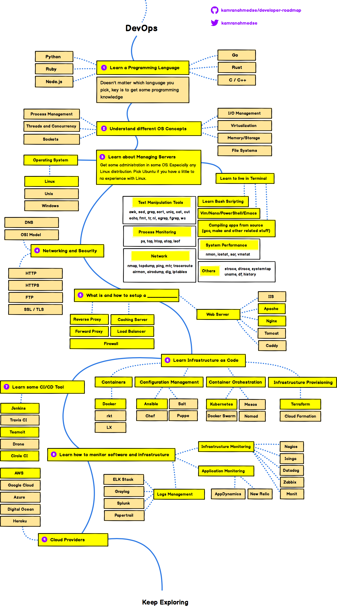

### 10 things a developer should know:

Technologies, Concepts, Practices, Functionality etc..

- HTML5, CSS3, JS
- Git & Github
- Chrome Dev Tools
- Consuming an API
    - [Publics APIs](https://github.com/public-apis/public-apis) - A collective list of free APIs for use in software and web development.
- Building a REST API & CRUD
- Authentication
- MVC (Model View controller)
- Problem Solving & Searching
- Writing Tests
- DevOps & Deployment 

### Roadmap to become a web developer in 2019:

Note: Below diagrams are copied from 
https://github.com/kamranahmedse/developer-roadmap

## Introduction

## Frontend Roadmap

## Backend Roadmap

## Devops Roadmap

