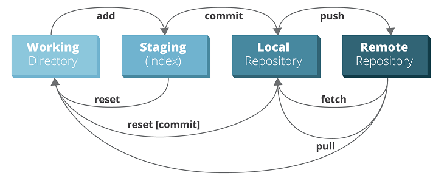
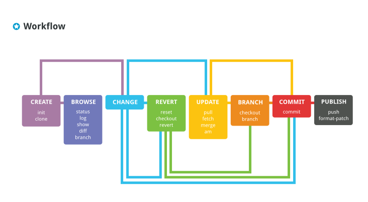

---

## Git Commands - Step by Step

### Initialize git repo
```git
git init
```

### Config username and email
```git
git config --global user.name 'Selvarajan'
git config --global user.email 'selvarajan2006@gmail.com'
```

### To check whats in staging area
```git
git status
```

### Remove file from staging
```git
git rm --cached index.html
```

### Add files to staging
```git
git add *.html
git add .
```

### Commit staged files
```git
git commit
```
It opens up vim editor where we can insert our comments and save it

```git
git commit -m 'changed app.js'
```

This commands skips the vim editor part and commits the changes with the comment.

### To ignore files during commit
Create a file called .gitignore and put in there the filenames and folder names.
	
### To create branch
```git
git branch login
```

### To switch branch
```git
git checkout login
```

Make changes in login branch

### To merge login branch

Switch to master branch and merge
```git
git checkout master
git merge login
```
This would open up the vim editor where we can add our comments and save.

### To list remote repositories
```git
git remote
```

### To add remote repo
```git
git remote add origin https://github.com/coder-selvarajan/myapp.git 
```

### To push changes to remote repository
```git
git push -u origin master
```
This command to be executed for the first time.. Next times the command is simpler.
```git
git push
```

### To clone remote repo
```git
git clone https://github.com/coder-selvarajan/myapp.git 
```

### To get the remote changes 
```git
git pull
```

## Advanced Git

### HEAD 

    git checkout f124343
    git checkout commit
    git show HEAD

    git tag v1.2
    git checkout v1.2

#### To see the commit history:  

    git log


