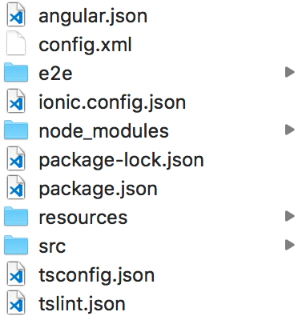

## Setup

#### Install nodejs & Update npm

#### Install Ionic
```
    npm install -g cordova ionic
```

#### Create app
```
    ionic start appName tabs --type=angular
```

#### View the app
```
    ionic serve
```

#### Install lab
```
    npm i @ionic/lab

    ionic lab
```

this will open slightly a different view with iOS & Andriod screens


#### Install db related plugins
```
    ionic cordova plugin add cordova-sqlite-storage
    npm install --save @ionic/storage
    
    npm install @ionic-native/sqlite
```

## Ionic Project Structure

The files inside of your folder might look quite scary and overwhelming if this is your first encounter with Ionic or an Angular project – but most of the time you will be working only in the src folder and can forget about the rest!

Your app folder will look very likely look like the one in the image below.

So what is all of that?

The *angular.json* holds configuration values for our Ionic/Angular project and you don’t really need to touch or change it in the beginning.

The *config.xml* is used once the native project is built from this Ionic project. If you need special permissions in the native app or change other stuff, it will be set inside this file.

The *e2e* folder holds the configuration for our testing setup that’s already included, but if you don’t plan to use testcases (which you definitely should at a later point) you can ignore the folder for now.

The *ionic.config.json* contains some basic information about your project and is used if you upload your app to the Ionic Pro platform.




The *node_modules* folder is automatically generated once you install the npm dependencies with “npm install” (Ionic already did this for you in the beginning). This command will scan the package.json for all the packages that need to be installed and is a classic Node.js file.

The *package.json* is a file that you will find in all Node projects. This file specifies which additional packages should be installed and helps to share you project, because other developers can simply install the dependencies of that file and their environment is ready as well!

The *resources* folder is an Ionic folder that can contain your app icon and splash screen.

The *src* folder is the most important folder, and 99% of your work will happen in that folder. It’s the folder that contains your actual Angular code!

The next two files (*tsconfig.json, tslint.json*) are related to TypeScript and how it gets compiled. We don’t really have to care for them, just keep them like they are and you are fine.

Once you add a platform you will also notice two more folders:

The *platforms* folder contains your native projects. You need to add them first (we will see how later) and they will be generated to this folder.

The *plugins* folder contains all the Cordova plugins that you installed. As you might know, these are the wrapper around native functions and we will use some of them later in this course.

The last folder that comes once you serve/build the app is the *www* folder which is auto generated and contains your current build. Don’t change code here, only in the app folder!

### More resources & Links

* Getting started with Ionic  
https://ionicacademy.com/getting-started-with-ionic-4/

* Store data inside Ionic  
https://ionicacademy.com/store-data-inside-ionic/

* Ionic Storage Crud operations  
https://ionicacademy.com/ionic-storage-crud-operations/
