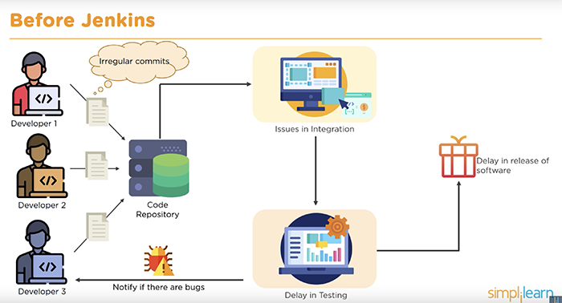
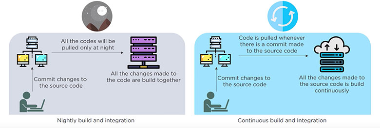
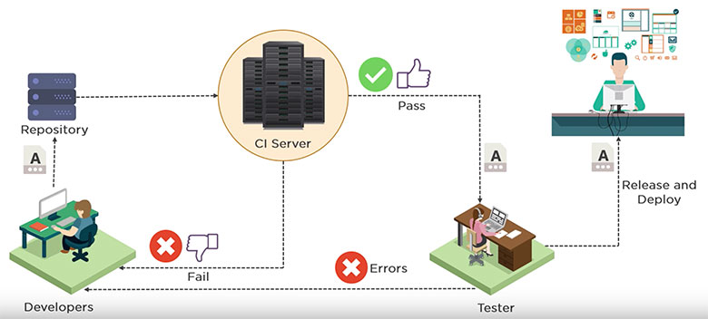
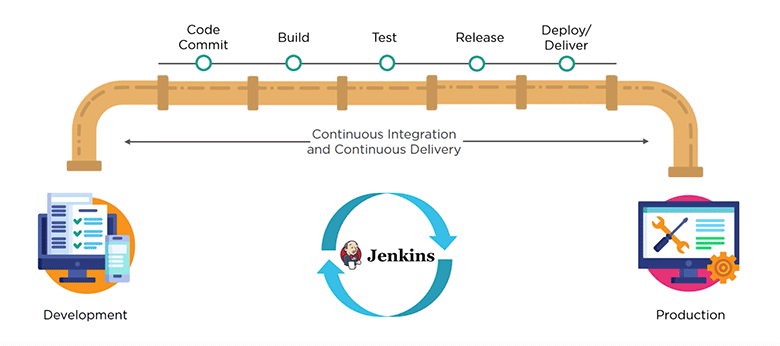
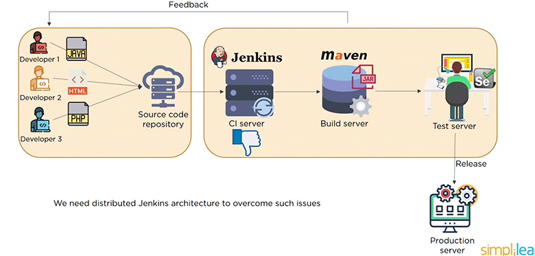
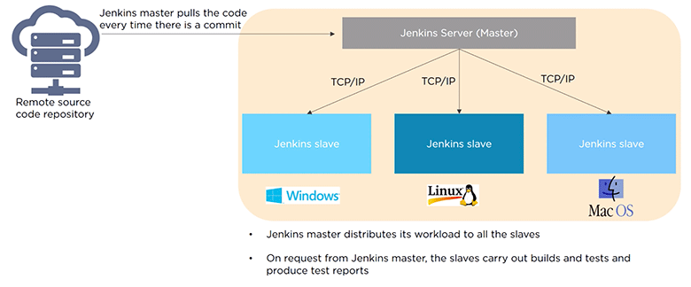

Below content and images are taken from [Simplilearn]()

## Before Jenkins

Developers had to wait till the entire software code was built and tested to check for errors

## What is Jenkins?

Jenkins is a continuous integration tool that allows continuous development, test and deployment of newly created codes. 

## What is continuous integration?

### Continuous Integration Tools

- Bamboo
- Buildbot
- Apache Gump
- Travis CI (Github)
- Jenkins 

## Jenkins Pipeline

## Jenkins Architecture

- Developer commit changes to the source code
- Jenkins server checks the repository at regular intervals and pulls any newly available code
- Build server builds the code into an executable file. Here, Java file is being converted into JAR file. In case the build fails, a feedback is sent to the developers. 
- Jenkins then deploys the build application on to test server for testing. If the test fails, feedback is immediately passed on to the developers.
- If there are no errors, the tested application is then deployed on to the production server. 

> Single Jenkins server cannot handle multiple files and builds. We need distributed Jenkins architecture to overcome such issues. 

### Jenkins - Master Slave Architecture

  
     
**Edureka Jenkins Crash Course Link:**   
https://www.youtube.com/watch?v=p7-U1_E_j3w&t=23s

