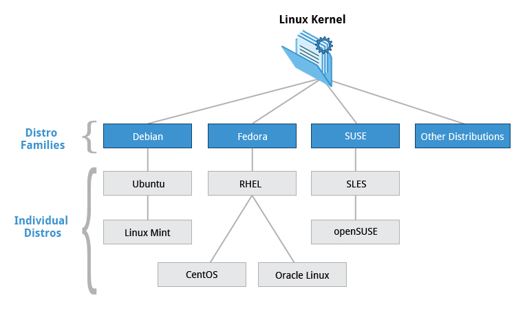

### **Linux Distributions**

Some of the key facts about the Fedora distribution family are:

+ The Fedora family is upstream for CentOS, RHEL, and Oracle Linux.
+ Kernel version 3.10 is used in RHEL/CentOS 7.
+ It supports hardware platforms such as x86, x86-64, Itanium, PowerPC, and IBM System z.
+ It uses the RPM-based yum package manager (we cover it in more detail later) to install, update, and remove packages in the system.
+ RHEL is widely used by enterprises which host their own systems.

| Above content is copied from this [Site](https://courses.edx.org/courses/course-v1:LinuxFoundationX+LFS101x+1T2017/courseware/0123a04c5dfc4a10b44f58a0a660c354/7ad3b9cb54b5456ea9d2685e955b049c/?child=first)

### **Linux Kernel**

- Linux kernel is the core
- Linux Kernel + Apps = Distro
- RHEL and Ubuntu

### **Linux Installation**

- Step 1: Install Virtualbox in windows
- Step 2: Download CentOS VDI(Virtual Disk Image)
